# Cognitive Performance Analysis Using Linear Regression

## Overview

This project analyzes factors that may influence cognitive performance using statistical methods and linear regression modeling in R.

The analysis examines behavioral and physiological variables such as sleep duration, stress level, caffeine intake, screen time, and physical activity in order to understand how they relate to cognitive performance.

The project was conducted as part of a course in **Linear Regression Models** and is divided into two main stages:

1. Exploratory Data Analysis  
2. Regression Modeling and Diagnostics  

The goal of the project is to explain the variability in **Cognitive_Score**, which represents the overall cognitive performance of each participant.

---

# Key Findings

A multivariate linear regression analysis was conducted to explain and predict **Cognitive_Score** using behavioral and physiological variables.

The analysis was implemented entirely in **R**, following the statistical methodology taught in the course, without modifying the original dataset.

During the preprocessing stage, univariate relationships between the dependent variable and candidate predictors were examined.  
Pearson correlation tests were used for continuous variables and one-way ANOVA tests for categorical variables.

Based on these results:

- **Age** was removed due to negligible linear correlation with Cognitive_Score.
- **Gender** was removed because category aggregation did not improve the model.

For the categorical variable **Diet_Type**, categories *Vegetarian* and *Vegan* were merged into a new category **PlantBased**, creating a dummy variable **Diet_2** with *Non-Vegetarian* as the reference group.

Several theoretically motivated interaction terms were evaluated.  
Among them, the interaction **Memory_Test_Score × Stress_Level** was found to be statistically significant and improved model fit. Other interactions such as:

- Daily_Screen_Time × Stress_Level  
- Daily_Screen_Time × Diet_2  

were not significant and therefore excluded.

Variable selection was performed using both **Forward Selection** and **Backward Elimination** according to the **AIC criterion**.  
Both procedures converged to the same model, reinforcing the stability of the selected specification.

The final model includes the variables:

- Sleep_Duration  
- Stress_Level  
- Daily_Screen_Time  
- Exercise_Frequency  
- Reaction_Time  
- Memory_Test_Score  
- Diet_2  
- Caffeine_Intake  

as well as the interaction:

- **Memory_Test_Score × Stress_Level**

Further model improvement analysis revealed evidence of **non-linearity for Caffeine_Intake**, and therefore a **second-degree polynomial term** was introduced.

Model assumptions were evaluated using:

- Residual vs Fitted plots
- Q-Q plots
- Shapiro-Wilk test
- Kolmogorov-Smirnov test
- Chow test for structural stability

Although the residual normality tests indicated deviations, these were interpreted in light of the large sample size, where even small deviations may lead to significant results.

A **Box-Cox transformation analysis** was performed for the dependent variable.  
The estimated parameter λ was very close to 1, indicating that no transformation of **Cognitive_Score** was necessary.

---

# Dataset Description

The dataset contains behavioral and physiological measurements for a large group of participants.

Each observation includes variables related to lifestyle, habits, and performance metrics.

### Dependent Variable

**Cognitive_Score**

Represents the overall cognitive performance score of the participant on a scale from 0–100.

Higher values indicate better cognitive performance.

### Explanatory Variables

| Variable | Description |
|--------|-------------|
| Age | Age of participant |
| Gender | Participant gender |
| Sleep_Duration | Average nightly sleep duration |
| Stress_Level | Self-reported stress level (1–10) |
| Diet_Type | Type of diet |
| Daily_Screen_Time | Average screen time per day |
| Exercise_Frequency | Weekly exercise frequency |
| Caffeine_Intake | Daily caffeine intake (mg) |
| Reaction_Time | Reaction time measurement |
| Memory_Test_Score | Memory performance test score |

---

# Project Structure

project
│
├── data
│ └── sample_data.xlsx
│
├── scripts
│ ├── R_part1.R
│ └── R_part2.R
│
├── reports
│ ├── project_part1.docx
│ └── project_part2.docx
│
├── screenshots
│ ├── part1
│ │ ├── histogram_screen.jpg
│ │ ├── cdf_screen.jpg
│ │ ├── reaction_vs_sleep.jpg
│ │ ├── reaction_vs_caffeine.jpg
│ │ ├── screen_vs_sleep_by_stress.jpg
│ │ ├── cognitive_across_sleep.jpg
│ │ └── cognitive_vs_screen_by_color.jpg
│ │
│ └── part2
│ ├── final_model.jpg
│ ├── interaction_memory_vs_stress.jpg
│ ├── res_vs_fitted.jpg
│ ├── qq_plot.jpg
│ └── box_cox.jpg
│
└── README.md

---

# Part 1 — Exploratory Data Analysis

The first stage focuses on understanding the structure and behavior of the dataset through descriptive statistics and visual analysis.

Key descriptive measures were computed, including:

- Mean
- Median
- Standard deviation
- Interquartile range
- Skewness

These statistics help characterize the distribution of variables and identify potential irregularities.

---

## Distribution of Screen Time

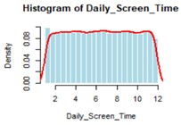

---

## Cumulative Distribution of Screen Time

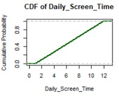

---

## Sleep Duration and Reaction Time

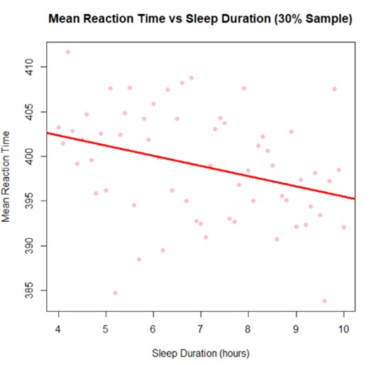

---

## Reaction Time and Caffeine Intake

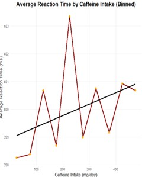

---

## Behavioral Patterns: Sleep, Screen Time and Stress

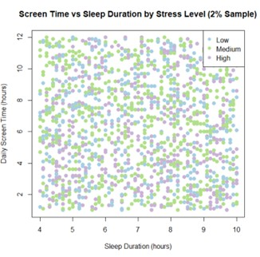

---

## Cognitive Performance by Sleep Duration

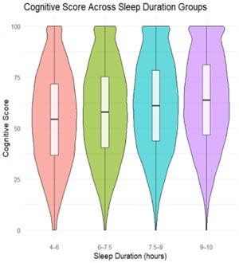

---

## Screen Time and Cognitive Score

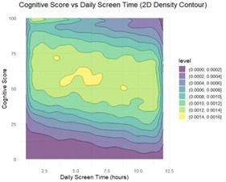

---

# Part 2 — Regression Modeling

The second stage focuses on constructing a multivariate linear regression model to explain the variation in **Cognitive_Score**.

Variable selection and model construction followed a structured statistical procedure including correlation analysis, ANOVA tests, and automated model selection using the **AIC criterion**.

---

## Final Regression Model

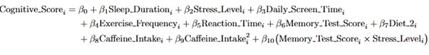

---

## Interaction Effect: Memory Score × Stress Level

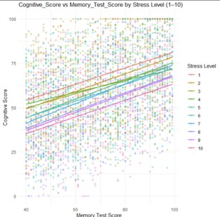

---

# Model Diagnostics

## Residuals vs Fitted

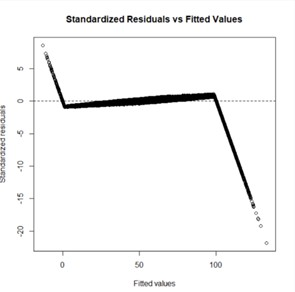

---

## Q-Q Plot of Residuals

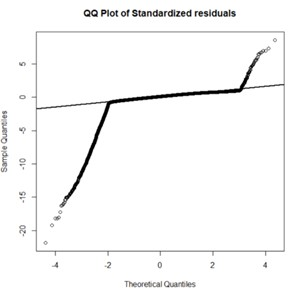

---

# Model Improvement

A Box-Cox transformation analysis was conducted in order to determine whether transforming the dependent variable could improve the regression model.

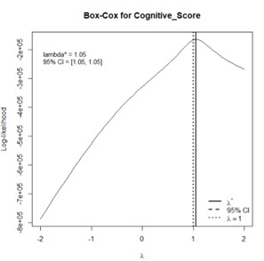

The estimated parameter:

λ ≈ 1

Therefore no transformation of **Cognitive_Score** was required.

---

# Technologies Used

- R  
- Linear Regression Modeling  
- Exploratory Data Analysis  
- Statistical Diagnostics  
- Data Visualization  

---

# Authors

Group Project — Linear Regression Models

- Yoav Nesher  
- Roi Laniado  

---

# Notes

This project was developed as part of coursework in statistical modeling and regression analysis.
